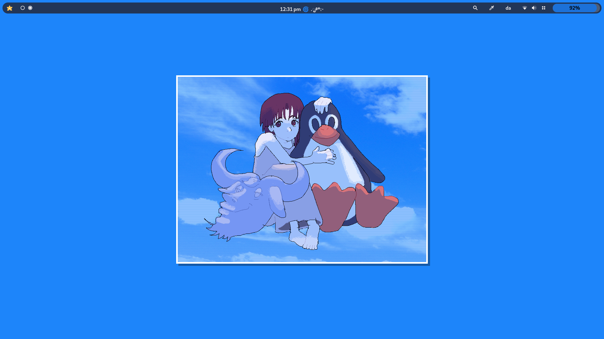
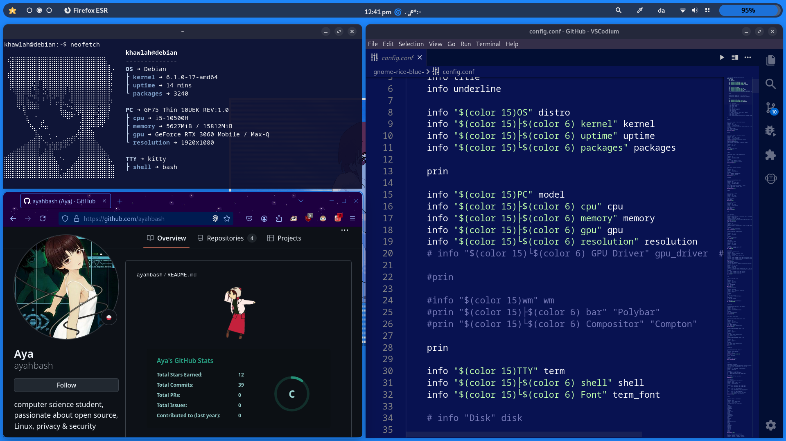
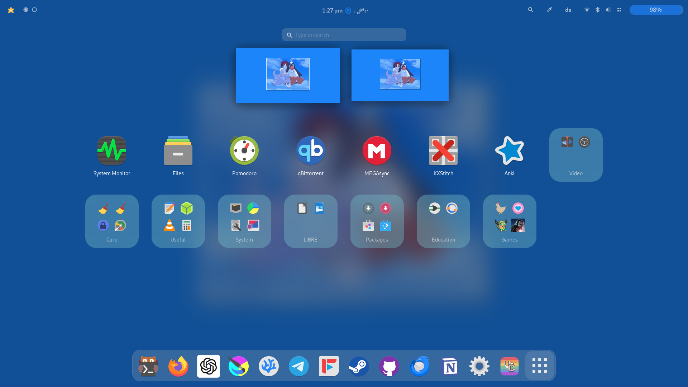

## blue lain 🌀

    
     
    
        
        
    

### 🐧 config details
- **gnome extensions** > [/extensions](/gnome/blue-lain/config-files/extensions/)
- **GTK theme** > [/theme](/gnome/blue-lain/config-files/themes/)
- **icons** > [/icons](/gnome/blue-lain/config-files/icons/)
- **kitty** > [/kitty](/gnome/blue-lain/config-files/kitty/)
- **neofetch** > [/neofetch](/gnome/blue-lain/config-files/neofetch/)
- **wallpaper** > [/wallpaper](/gnome/blue-lain/config-files/wallpaper.png)